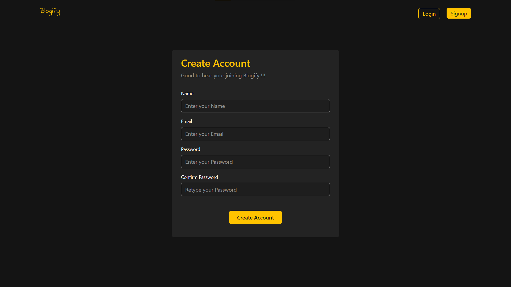
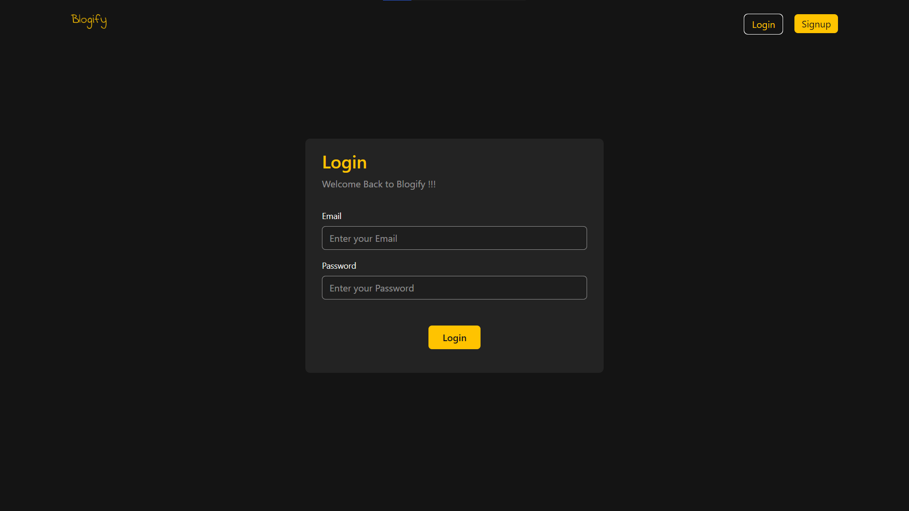
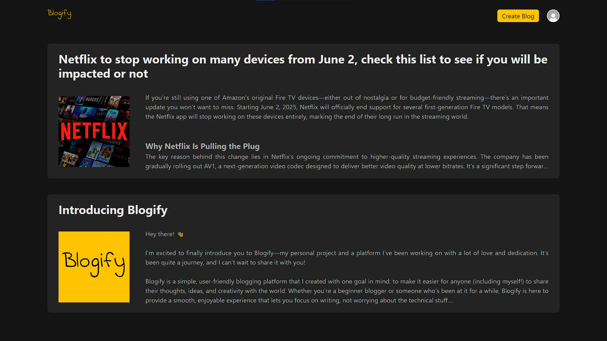
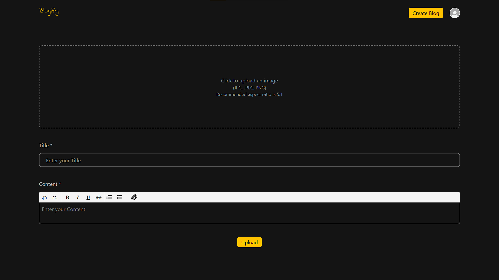
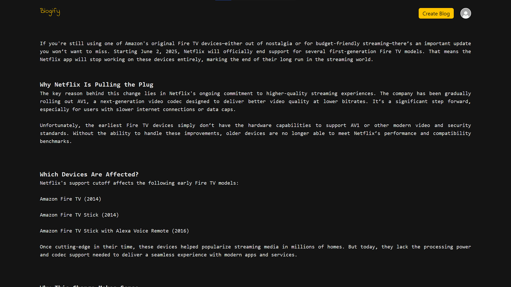
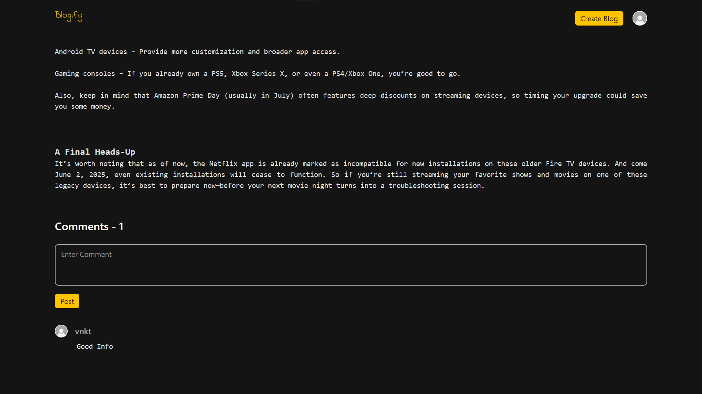
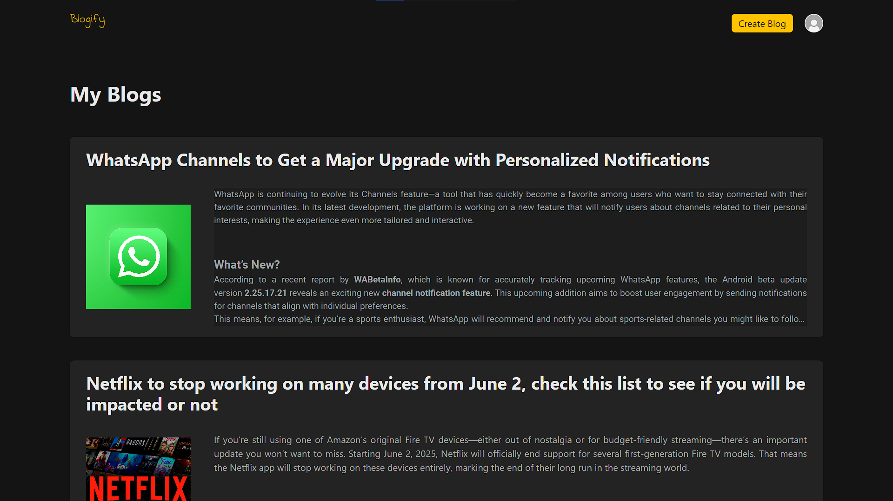

# Blogify

Blogify is a simple MERN stack blogging application with user authentication, image uploads, and a clean React + Tailwind front-end.

## Tech stack

- Backend: Node.js, Express
- Database: MongoDB (Mongoose)
- Authentication: JSON Web Tokens (jsonwebtoken) stored in httpOnly cookies
- File uploads: Multer (stored under `server/public/uploads`)
- Frontend: React (Vite), React Router, Tailwind CSS
- Dev tools: Nodemon, Vite, concurrently

## Project structure (high level)

- `server/` - Express API and server-side code
  - `index.js` - Server entry (listens on PORT 8001 by default)
  - `routes/` - API routes (`user.js`, `blog.js`)
  - `models/` - Mongoose models (`user.js`, `blog.js`, `comments.js`)
  - `services/` - Authentication helpers
  - `middlewares/` - Request middlewares (authentication)
  - `public/uploads` - uploaded blog images
  - `public/images` - static images used by the app
- `client/` - React app (Vite)
  - `src/` - React source

## Quick summary of what I found

- Server default port: `8001` (see `server/index.js`).
- Client (Vite) default port: `5173` (typical Vite default). Frontend code expects the API at `http://localhost:8001` (many axios calls and image URLs).
- Important environment variables: `MONGO_URL` is required for MongoDB connection. The authentication service now reads `JWT_SECRET` from the environment (falls back to `SECRET_KEY_BLOGGER` if not set). Set `JWT_SECRET` for production.
- CORS is configured to allow origin `http://localhost:5173` (see `server/index.js`). Update this when deploying.
- I fixed a minor issue where `server/package.json` referenced `app.js` for start/dev scripts while the actual server entry file is `index.js`. The scripts were updated to `node index.js` and `nodemon index.js`.

## Prerequisites

- Node.js (v18+ recommended)
- npm (or yarn)
- MongoDB (local or cloud URI)

## Environment variables

Create a `.env` file in `server/` with at least the following variables:

```
MONGO_URL=<your-mongo-connection-string>
PORT=8001 # optional, defaults to 8001
# Recommended: replace hardcoded JWT secret in server/services/authentication.js with an env var, e.g. JWT_SECRET
JWT_SECRET=your_jwt_secret_here
```

Note: the authentication service now uses `process.env.JWT_SECRET` with a fallback. For security, make sure to set `JWT_SECRET` in production environments and never commit secrets to source control.

## Local setup (development)

1. Clone the repo:

```powershell
git clone <repo-url>
cd blogify
```

2. Install dependencies

```powershell
# From project root
npm install
# Server
cd server
npm install
# Client
cd ../client
npm install
cd ..
```

3. Create `server/.env` and add `MONGO_URL` (and optionally `PORT`/`JWT_SECRET`).

4. Start the app in development mode (runs both server and client using concurrently):

```powershell
# From project root
npm run dev
```

Alternatives:

- Start server only:

```powershell
cd server
npm run dev      # uses nodemon index.js
# or
npm start         # node index.js
```

- Start client only:

```powershell
cd client
npm run dev
```

## Building for production (client)

To build the front-end:

```powershell
cd client
npm run build
```

You can then serve the built files with a static server (or integrate with an Express static serving route). In production you'll need to:

- Host the client (Vite build output) from a static server or CDN
- Host the server on a Node host (Heroku, Render, Railway, DigitalOcean, etc.)
- Configure `MONGO_URL` and `JWT_SECRET` in your deployment environment
- Update CORS allowed origins in `server/index.js` to the production client origin

## API Endpoints (summary)

- GET /api - returns { user, blogs }
- POST /user/register - register a new user
- POST /user/login - logs in user, sets httpOnly cookie `token`
- GET /user/logout - clears cookie
- GET /user/verify - checks login using cookie
- POST /blog/ - create a new blog (multipart, field name `image`), requires authentication
- GET /blog/myblogs - get blogs created by current user
- GET /blog/:id - get a blog with comments
- POST /blog/comments/:id - add comment to blog

## Uploads & static files

- Uploaded images are saved to `server/public/uploads` and served at `http://localhost:8001/uploads/<filename>`.
- Static images in `server/public/images` are served at `/images`.

## Screenshots


- Signup page: `./screenshots/Signup.png`
- Login page: `./screenshots/Login.png`
- Home page: `./screenshots/Home.png`
- Create blog page: `./screenshots/CreateBlog.png`
- Blog page: `./screenshots/Blog1.png`
- Blog page: `./screenshots/Blog2.png`
- Blog page: `./screenshots/Blog3.png`
- My blogs page: `./screenshots/MyBlogs.png`

















## Troubleshooting

- "MongoDB connection error": Make sure `MONGO_URL` in `server/.env` is correct and MongoDB is accessible.
- CORS errors: ensure your client origin is included in CORS configuration in `server/index.js`.
- File upload errors: ensure `server/public/uploads` exists and is writable.

## Notes & recommended improvements

- Move the JWT secret out of source and into an environment variable (`JWT_SECRET`).
- Add input validation and better error handling for API endpoints.
- Add tests for API and core utilities.
- For production, consider storing uploads in cloud storage (S3 / Cloud Storage) instead of local disk.


If you want, I can also:

- Replace the hardcoded JWT secret with an env-var-based implementation and add instructions.
- Add a small script to serve the client `dist` folder from the Express server for an integrated deployment.
